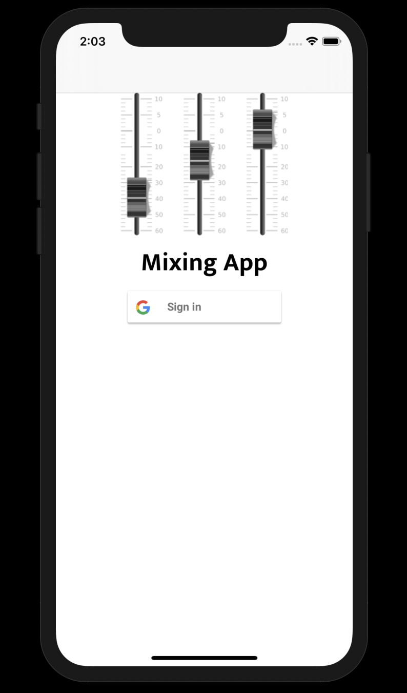

# FinalApp-UIControlProblem

## Description

The app starts off with the login screen where you can sign into the app using google sign-in.

Then when authenticated it will bring you to a new window where you can select your projects or create a new one. If not created just click the plus button and it will prompt you to name your project.

Select your project.

Now we are inside the project where you can see 6 tracks in a collection with a pan knob, volume slider, mute and solo button, and a label telling you which track it is.
As well as an eq window with 8 knobs that modify the whole frequency spectrum. (20hz-20khz)
A play button and a go back button that restarts the song.

Double tap on the track name label and the cell will flip around showing Import Track, Remove Track, or Go back

Tapping Import Track: This will open up a files controller that will show the audio files in your phone, select one and confirm it and then that the audio file is imported into that track!

Tapping Remove Track: This will remove the audio file from the track and the database.

Tapping Go Back: This will flip the cell back around so you can access the tracks properties.
